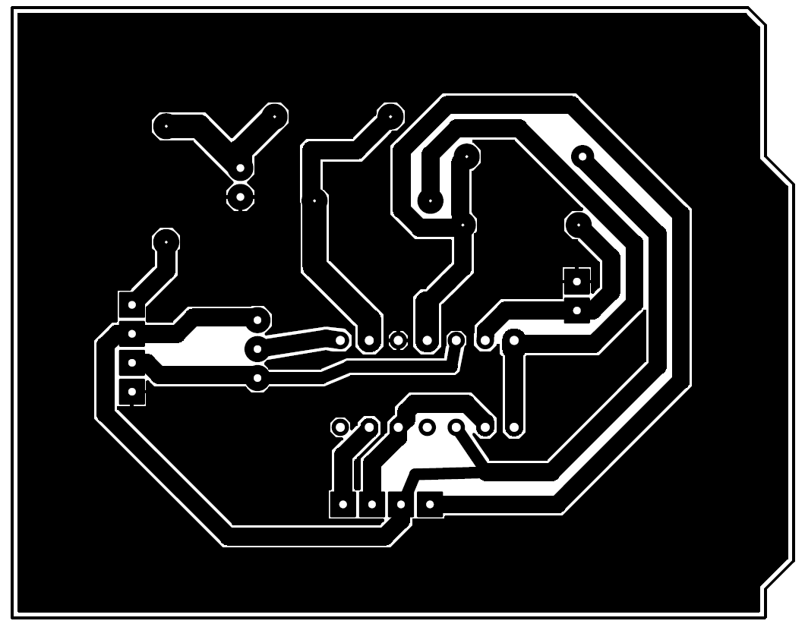
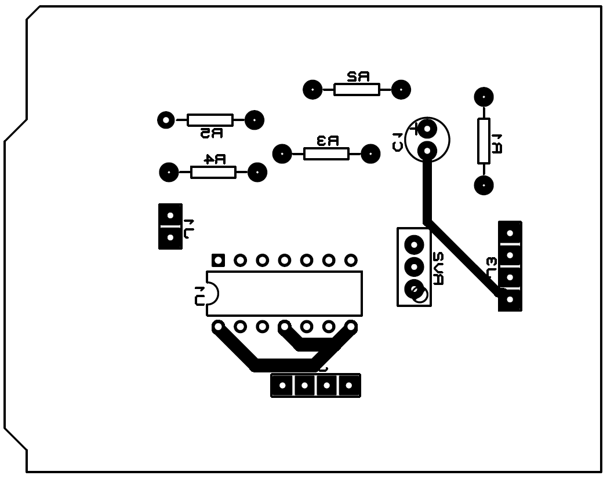
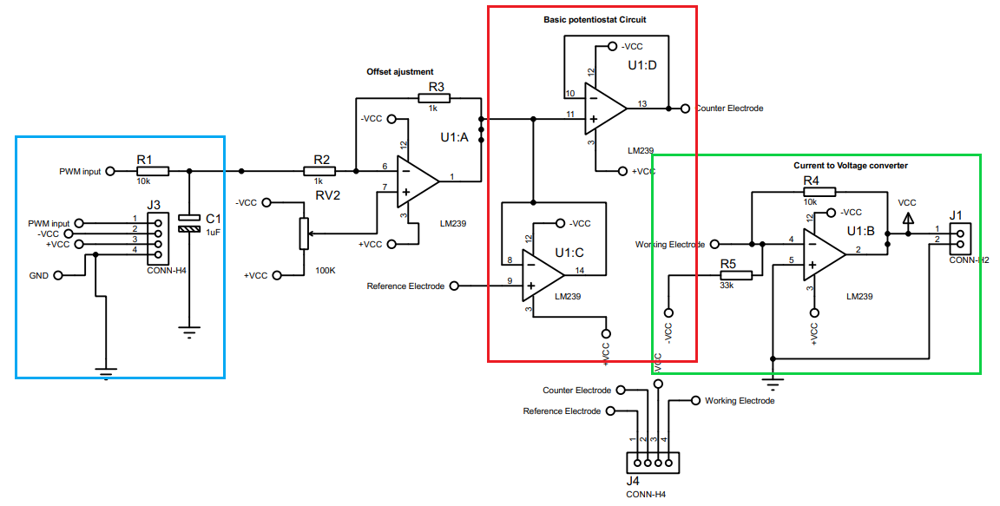
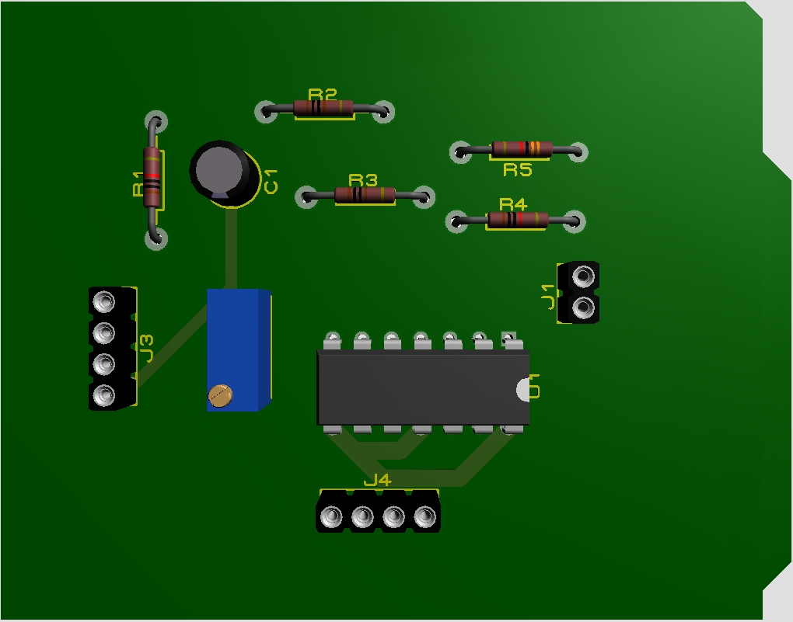
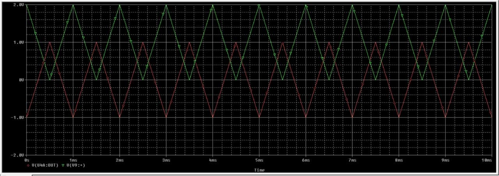
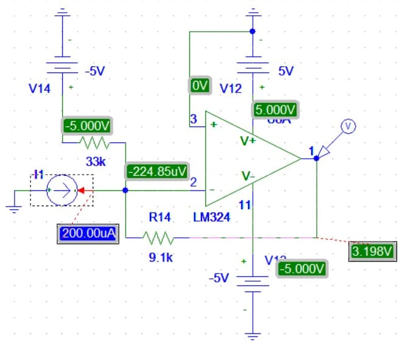

# water-analysis-system

>Elaboração de um projeto de hardware que é capaz de detectar a presença de sal ou açúcar na água.

Índice
* Lista de materiais
* Simulação do circuito
* Design da placa de circuito impresso
* Metodologia
	* Condições de análise
	* Conversor digital analógico + onda triangular
	* Conversor Corrente-Tensão
* Software do sistema
	* Utilizar técnica de voltametria cíclica
	* Exportar arquivo CSV
	* interfacegráfica

## Lista de Materiais
 
* Operacional [LM239]() - uma unidade contém 4 operacionais;
* Resistores:
	* 1k - 2 unidades;
	* 5.6k - 1 unidade;
	* 10k - 1 unidade;
	* 33k - 1 unidade . 
* Potenciômetro de 100k - 1 unidade;
* 1 Capacitor de 10nF;

### Softwares de simulação

Foi utilizado o [PSpice](https://www.electronics-lab.com/downloads/circutedesignsimulation/?page=5), software gratuito, para simular os sinais e circuitos apresentados no trabalho.<br>
Na modelagem e construção da placa de circuito impresso foi utilizado o Proteus. 

## Design da placa de circuito impresso

Na figura abaixo é apresentada o design da placa :

<p align="center">
  
  
</p>


## Metodologia

A detecção da presença do sal na água é determinada por um led, uma vez que os terminais são aplicados dentro da solução, o LED ascenderá caso uma concentração de sal esteja presente.

Para simular a voltametria cíclica foram levadas em consideração as seguintes condições :

* Pela Lei da corrente Faradáica sabe-se que a corrente gerada pelo eletrodo é proporcional à concentração de analito presente na solução. Entretanto, para fins de simulação foi estabelecido que a corrente máxima e mínima Faradáica seria 200uA e -200uA respectivamente.

* Condição de concentração do analito.  

### Eletrodo

Nos parâmetros utilizados para simular a técnica de voltametria cíclica, levou-se em consideração uma célcula eletroquímica de Platina e eletrodos de carbono ([Crespo](https://run.unl.pt/bitstream/10362/53149/1/Crespo_2017.pdf), pg.35).   


### Cicuito 
<!-- 
1. Filtro RC para gerar onda triangular
2. Ajuste de offset
3. Circuito básico do potenciostato
4. Conversor Corrente tensão
-->
Na figura abaixo observa-se o circuito da aplicação

<p align="center">
  
  
</p>

**Fitro RC**

Foi utilizado um filtro RC passa baixas para modificar o sinal PWM para um onda triangular ou rampa. Observa-se na figura do circuito, destacado em azul os valores do resistor e capacitor, tendo então:

```
Mostrar o cálculo
```

**Ajuste de Offset**

O sinal PWM gerado pelo arduino uno tem amplitude de 2Vpp, e agora convertido para onda triangular, varia entre 0 e 2V. Entretando na voltametria cíclica se faz necessário utilizar pulsos negativos, portanto
foi adicionado o módulo *Offset Ajustment* para obter uma saída triangular variando entre -1 e 1V. O ajuste é realizado pelo potenciômetro de 100kOms.

<p align="center">
  
</p>

**Circuito potenciostato**

It compares the measured Cell voltage with the desire voltage and drives current into the cell to force the voltages to be the same in an inverting configuration to provide the negative feedback

**Conversor Corrente Tensão**

Levando em consideração as condições de análise, foi simulado o módulo de conversão da corrente proveniente do eletrodo de trabalho ou *working electrode* (WE). Essa conversão é necessária para que o microcontrolador possa receber o sinal. A saída do conversor é limitada entre 0 e 3.3V já que a tensão será lida pelo [ESP01](#esp01). 

<p align="center">
  
</p>

### ESP01

O ESP01 é um microchip de baixo custo que vem sendo amplamente utilizado em protótipos de projetos de IoT e pode ser programável pela plataforma Arduino.
O módulo ESP-01 suporta o padrão IEEE 802.11 b/g/n, protocolo TCP/IP, modo estação e ponto de acesso, isto permite que seja utilizado para conexão WiFi, controle e criação de redes e comunicação entre aplicações e dispositivos.
E este módulo é utilizado para receber e tratar os sinais de saída do circuito da **Figura X**. Uma vez que o ESP é configurado para realizar a leitura do sinal, o microcontrolador irá enviar os dados para o Firebase, que por sua vez amazenará estas informações. E por fim esses dados serão consultados pela [interface gráfica]().


### Arduino uno


## Interface gráfica

1. Uso do Firebase