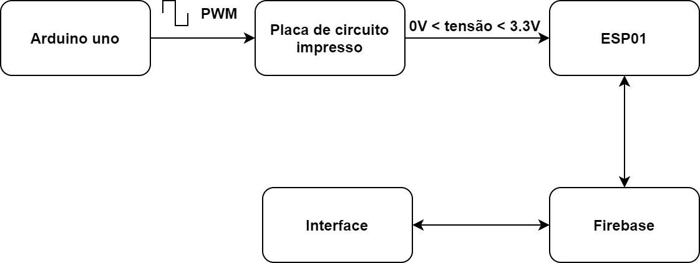
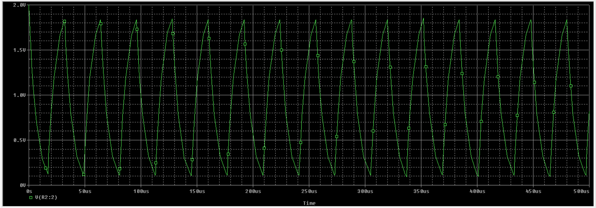
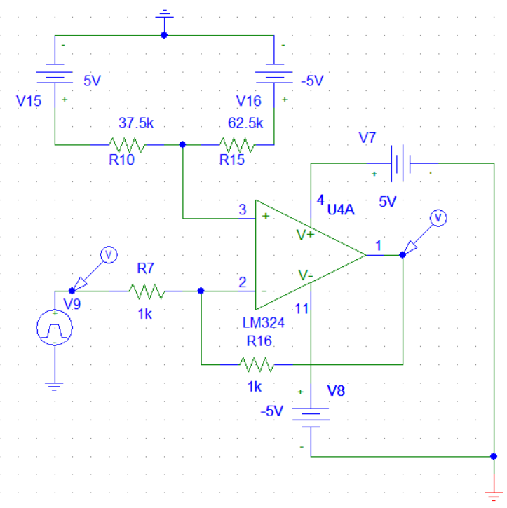
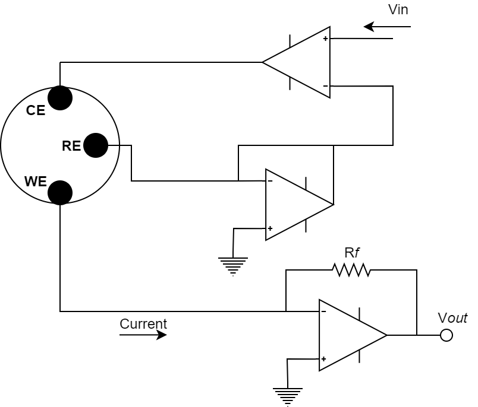
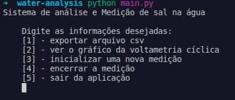

# water-analysis-system

>Elaboração de um projeto de hardware que é capaz de detectar a presença de sal ou açúcar na água.

## Índice

<ol align="left">
  <li><a href="#10-objetivo">Objetivo</a></li>
  <li><a href="#20-proposta-de-solução">Proposta de solução</a></li>
  <li><a href="#30-desenvolvimento">Desenvolvimento</a>
    <ol>
      <li><a href="#31-arduino-uno">Arduino uno</a></li>
      <li><a href="#placa-de-circuito-impresso">Placa de circuito impresso</a></li>
      <li><a href="#interface">Interface</a></li>
      <li><a href="#firebase">Firebase</a></li>
    </ol>
  </li>
  <li><a href="#softwares-de-simulação">Softwares de simulação</a></li>
  <li><a href="#lista-de-materiais">Lista de materiais</a></li>
  <li><a href="#5_0-referências">Referências</a></li>
</ol>

<!-- 
1. Objetivo
2. Proposta
3. Desenvolvimento
  3.1 Arduino Uno
  3.2 Placa de circuito impresso
    3.2.1 Filtro RC
    3.2.2 Ajuste de offset
    3.2.3 Circuito base para potenciostato
    3.2.4 Conversor corrente-tensão
  3.3 Interface + Firebase
4. Lista de materiais
5. Referências 
-->
## 1.0 Objetivo

Elaboração de um projeto de hardware que é capaz de detectar a presença de sal na água.

## 2.0 Proposta de solução

Verificação da variação da corrente aplicando voltametria cíclica.
Meu circuito é capaz de detectar a presença de sal na solução uma vez que a resposta do circuito será caracterizado pela variação da corrente, evento este que ocorre devido ao uso da técnica de voltametria cíclica.

## 3.0 Desenvolvimento

A detecção da presença do sal na água é determinada uma vez que houver alteração dos níveis de tensão na entrada do ESP. Uma vez que a água irá se tornar mais condutora com o sal dissolvido nesta, analogamente haverá a detecção da presença do material na água.

Para simular a voltametria cíclica foram levadas em consideração as seguintes condições :

* Pela Lei da corrente Faradáica sabe-se que a corrente gerada pelo eletrodo é proporcional à concentração de analito presente na solução. Tendo isto em vista, foi estabelecido que a corrente máxima e mínima Faradáica seria 200*u*A e -200*u*A respectivamente para fins de simulação.

A proposta do presente projeto foi efetuada com base nas etapadas presentes na seguinte figura :

  

### 3.1 Arduino uno

Foi utilizado o [arduino uno](https://www.farnell.com/datasheets/1682209.pdf) para gerar o sinal PWM como entrada do circuito modelado, sendo também responsável pelo controle da **frequência, amplitude e duty cycle** da onda retangular. O pulso é caracterizado por uma amplitude de 2Vpp (de 0 à 2V) e frequência de aproximadamente 31kHz. Todos esses fatores influenciam na aquisição do sistema e posteriormente serão configuráveis.

Para um primeiro momento, tem-se [código](./embedded_system/pwm_generator.ino) utilizado para a programação do arduino uno e, os pontos em destaque são basicamente a mudança da frequência de saída ao alterar os registradores e o controle do duty cycle pelos dois laços de repetição.

A funcionalidade de oscilação de onda quadrada poderia ser resolvida utilizando um [LM555](https://www.ti.com/lit/ds/symlink/lm555.pdf), porém em atualizações futuras será feita a comunicação entre o arduino uno e o ESP01. Além disso permite adicionar uma maior complexidade ao projeto.

### 3.2 Placa de circuito impresso

Este módulo do projeto é responsável pelo tratamento do sinal de onda quadrada, ajuste de offset e conversão de corrente para tensão.

Na figura abaixo tem-se o esquema do circuito projetado, e destacam-se quatro partes (cada foi parte simulada separadamente). 

  

Na figura abaixo observa-se o resultado final da placa do circuito: 

  
  
  

### 3.3 Fitro RC

<!-- Mostrar cálculos e circuito -->

Foi utilizado um filtro RC passa baixas para modificar o sinal PWM para um onda triangular ou rampa. Observa-se na figura do circuito, destacado em azul os valores do resistor e capacitor, tendo então:

  

### 3.4 Ajuste de Offset

O sinal PWM gerado pelo arduino uno tem amplitude de 2Vpp, e agora convertido para onda triangular, varia entre 0 e 2V. Entretando na voltametria cíclica se faz necessário utilizar pulsos negativos, portanto
foi adicionado o módulo *Offset Ajustment* para obter uma saída triangular variando entre -1 e 1V. O ajuste é realizado pelo potenciômetro de 100kOms.

   
  Figura : Circuito para ajuste de offset

**Resultado da simulação**

Percebe-se na figura abaixo a correção do offset, uma vez que a onda triangular verde é o sinal de entradam, e a onda triangular vermelha é a o sinal de saída. Então, nota-se que foi realizada a movimentação da onda triangular no eixo y (tensão), ou seja, foi adicionado o um offset de -1V sob o sinal.

   
  Figura : Resultado da simulação 

### 3.5 Circuito potenciostato

O circuito base consiste em 3 pontos principais, um operacional que realiza a comparação da tensão entre o **CE** (*counter electrode* ou eletrodo contador) e **RE** (*reference electrode* ou eletrodo de referência), de modo que a tensão seja igual à tensão aplicada na entrada do operacional. A segunda parte consiste na configuração **seguidor emissor** para o sinal do eletrodo de referência, esse circuito é necessário pois deseja-se que a corrente presente nesta conexão seja nula ou despresível, fato este possível devido ao amplificador ter alta impedância de entrada. 
Por fim a terceira parte é referente a conversão da corrente gerada pelo *working electrode* (WE) ou eletrodo de trabalho para tensão. A conversão é feita pelo resistor R*f*, que terá valor variado dependendo da magnitude da corrente, dependendo da reação eletroquímica os valores podem ter variações consideráveis ou não ([2](https://iopscience.iop.org/article/10.1088/1742-6596/1550/4/042049/pdf)). 
A figura abaixo representa o circuito base para controle e medição da resposta dos eletrodos. 

  

### 3.6 Conversor Corrente Tensão

Levando em consideração as condições de análise, foi simulado o módulo de conversão da corrente proveniente do eletrodo de trabalho ou *working electrode* (WE). Essa conversão é necessária para que o microcontrolador possa receber o sinal. A saída do conversor é limitada entre 0 e 3.3V já que a tensão será lida pelo [ESP01](#esp01). Pode-se observar na figura abaixo uma entrada de -200*u*A e uma saída de aproximadamente 3.2V, que seria a tensão máxima.   

  

### 3.7 ESP01

O ESP01 é um microchip de baixo custo que vem sendo amplamente utilizado em protótipos de projetos de IoT e pode ser programável pela plataforma Arduino.
O módulo ESP-01 suporta o padrão IEEE 802.11 b/g/n, protocolo TCP/IP, modo estação e ponto de acesso, isto permite que seja utilizado para conexão WiFi, controle e criação de redes e comunicação entre aplicações e dispositivos. 
E este módulo é utilizado para receber e tratar os sinais de saída do circuito. Uma vez que o ESP é configurado para realizar a leitura do sinal, o microcontrolador irá enviar os dados para o Firebase, onde haverá conexão com um banco de dados em tempo real que por sua vez amazenará estas informações. E por fim esses dados serão consultados pela [interface gráfica](#interface-gráfica). 
O uso do ESP + Firebase permite que o usuário possa visualizar os dados remotamente.

### 3.8 Eletrodo

Nos parâmetros utilizados para simular a técnica de voltametria cíclica, levou-se em consideração uma célcula eletroquímica de Platina e eletrodos de carbono ([1](https://run.unl.pt/bitstream/10362/53149/1/Crespo_2017.pdf), pg.35).

## Interface

A interface gráfica é via terminal, e ao executar o programa permite comandos para extrair os dados em arquivo CSV, visualização do gráfico da voltametria cíclica. Além disso o usuário pode controlar o início e o fim da medição. Por fim pode sair do sistema.

  

É necessário que tenha o python instalado na máquina e instalar os pacotes **Pandas** e **Pyrebase**. Para mais detalhes verifique o [código](./interface/main.py).

## 4.0 Lista de Materiais

Lista de componentes e hardware utilizado: 

* Operacional [LM324](https://www.alldatasheet.com/datasheet-pdf/pdf/17871/PHILIPS/LM324.html) - uma unidade contém 4 operacionais;
* Resistores:
	* 1k - 2 unidades;
	* 5.6k - 1 unidade;
	* 9.1k - 1 unidade;
	* 33k - 1 unidade . 
* Potenciômetro de 100k - 1 unidade;
* Capacitor de 10nF - 1 unidade;
* Arduino uno - 1 unidade;
* ESP01 - 1 unidade;
* Fonte de alimentação simétrica +-5V;

### 4.1 Softwares de simulação

* [PSpice](https://www.electronics-lab.com/downloads/circutedesignsimulation/?page=5): software gratuito, para simular os sinais e circuitos apresentados no trabalho.

* [Proteus](#): Na modelagem e construção da placa de circuito impresso foi utilizado o software. 

* [IDE arduino](#): programação e simulação do arduino uno e ESP01 

## 5.0 Referências

[1](#) Ning, Z & Huang, J & Guo, S & Wang, L. (2020). A Portable Potentiostat for Three-Electrode Electrochemical Sensor. Journal of Physics: Conference Series. 1550. 042049. 10.1088/1742-6596/1550/4/042049. 

[2](#) Crespo, J. R. (2017). Electrochemical-SERS analysis of R6G using a microcontroller based Portable Potentiostat (Doctoral dissertation). 

[3](#) WEBSTER, H. E. J. G.Measurement, Instrumentation, and Sensors Handbook:Electromagnetic, Optical, Radiation, Chemical, and Biomedical Measurement. 2. ed.[S.l.]: CRC Press, 2014. 1921 p. ISBN 1439848912. 
