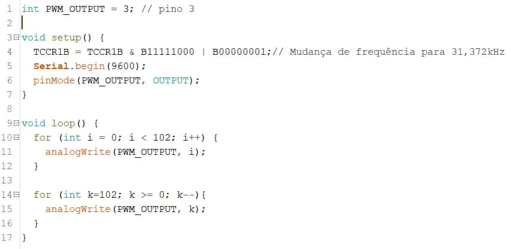

# water-analysis-system

>Elaboração de um projeto de hardware que é capaz de detectar a presença de sal ou açúcar na água.

## Índice
<ul align="left">
  <li><a href="#lista-de-materiais">Lista de materiais</a></li>
  <li> <a href="#softwares-de-simulação">Softwares de simulação</a></li>
  <li> <a href="#design-da-placa-de-circuito-impresso">Design da placa de circuito impresso</a></li>
  <li> <a href="#metodologia">Metodologia</a></li>
  <li> <a href="#cicuito-e-simulação">Cicuito e simulação</a></li>
  <li> <a href="#esp01">ESP01</a></li>
  <li> <a href="#arduino-uno">Arduino uno</a></li>
  <li> <a href="#interface-gráfica">Interface gráfica</a></li>
</ul>

## Lista de Materiais

* Operacional [LM324](https://www.alldatasheet.com/datasheet-pdf/pdf/17871/PHILIPS/LM324.html) - uma unidade contém 4 operacionais;
* Resistores:
	* 1k - 2 unidades;
	* 5.6k - 1 unidade;
	* 9.1k - 1 unidade;
	* 33k - 1 unidade . 
* Potenciômetro de 100k - 1 unidade;
* Capacitor de 10nF - 1 unidade;
* Arduino uno - 1 unidade;
* ESP01 - 1 unidade;
* Fonte de alimentação simétrica +-5V;

## Softwares de simulação

Foi utilizado o [PSpice](https://www.electronics-lab.com/downloads/circutedesignsimulation/?page=5), software gratuito, para simular os sinais e circuitos apresentados no trabalho. 
Na modelagem e construção da placa de circuito impresso foi utilizado o software Proteus. 

## Design da placa de circuito impresso

Na figura abaixo é apresentada o design da placa :

  
  

## Metodologia

A detecção da presença do sal na água é determinada uma vez que houver alteração dos níveis de tensão na entrada do ESP. Uma vez que a água irá se tornar mais condutora com o sal dissolvido nesta, analogamente haverá a detecção da presença do material na água.
Para simular a voltametria cíclica foram levadas em consideração as seguintes condições :

* Pela Lei da corrente Faradáica sabe-se que a corrente gerada pelo eletrodo é proporcional à concentração de analito presente na solução. Entretanto, para fins de simulação foi estabelecido que a corrente máxima e mínima Faradáica seria 200*u*A e -200*u*A respectivamente.

A figura abaixo apresenta o esquemático do trabalho: 

  

O controle do pulso é enviado por um Arduino uno, em que este envia uma onda quadrada com amplitude de 2Vpp e frequência de 31kHz. No segundo módulo consiste na placa de circuito impresso responsável pela conversão da onda quadrada para onda triangular, ajuste de *offset* e conversão corrente para tensão.
Por fim, temos o módulo EPS01 que recebe o sinal e envia os dados para o [Firebase](https://firebase.google.com/) e estes dados serão acessados pela interface web. 

### Eletrodo

Nos parâmetros utilizados para simular a técnica de voltametria cíclica, levou-se em consideração uma célcula eletroquímica de Platina e eletrodos de carbono ([1](https://run.unl.pt/bitstream/10362/53149/1/Crespo_2017.pdf), pg.35).   

## Cicuito e simulação

Na figura abaixo observa-se o circuito da aplicação

  
  

**Fitro RC**

Foi utilizado um filtro RC passa baixas para modificar o sinal PWM para um onda triangular ou rampa. Observa-se na figura do circuito, destacado em azul os valores do resistor e capacitor, tendo então:

  

**Ajuste de Offset**

O sinal PWM gerado pelo arduino uno tem amplitude de 2Vpp, e agora convertido para onda triangular, varia entre 0 e 2V. Entretando na voltametria cíclica se faz necessário utilizar pulsos negativos, portanto
foi adicionado o módulo *Offset Ajustment* para obter uma saída triangular variando entre -1 e 1V. O ajuste é realizado pelo potenciômetro de 100kOms.
Como é possível observar nas figuras abaixo, a onda triangular de cor vermelha é o sinal da saída do circuito.

   
  Figura : Circuito para ajuste de offset 
   
  Figura : Resultado da simulação 

**Circuito potenciostato**

O circuito base consiste em 3 pontos principais, um operacional que realiza a comparação da tensão entre o **CE** (*counter electrode* ou eletrodo contador) e **RE** (*reference electrode* ou eletrodo de referência), de modo que a tensão seja igual à tensão aplicada na entrada do operacional. A segunda parte consiste na configuração **seguidor emissor** para o sinal do eletrodo de referência, esse circuito é necessário pois deseja-se que a corrente presente nesta conexão seja nula ou despresível, fato este possível devido ao amplificador ter alta impedância de entrada. 
Por fim a terceira parte é referente a conversão da corrente gerada pelo *working electrode* (WE) ou eletrodo de trabalho para tensão. A conversão é feita pelo resistor R*f*, que terá valor variado dependendo da magnitude da corrente, dependendo da reação eletroquímica os valores podem ter variações consideráveis ou não ([2](https://iopscience.iop.org/article/10.1088/1742-6596/1550/4/042049/pdf)). 
A figura abaixo representa o circuito base para controle e medição da resposta dos eletrodos. 

  

**Conversor Corrente Tensão**

Levando em consideração as condições de análise, foi simulado o módulo de conversão da corrente proveniente do eletrodo de trabalho ou *working electrode* (WE). Essa conversão é necessária para que o microcontrolador possa receber o sinal. A saída do conversor é limitada entre 0 e 3.3V já que a tensão será lida pelo [ESP01](#esp01). Pode-se observar na figura abaixo uma entrada de -200*u*A e uma saída de aproximadamente 3.2V, que seria a tensão máxima.   

  

## ESP01

O ESP01 é um microchip de baixo custo que vem sendo amplamente utilizado em protótipos de projetos de IoT e pode ser programável pela plataforma Arduino.
O módulo ESP-01 suporta o padrão IEEE 802.11 b/g/n, protocolo TCP/IP, modo estação e ponto de acesso, isto permite que seja utilizado para conexão WiFi, controle e criação de redes e comunicação entre aplicações e dispositivos. 
E este módulo é utilizado para receber e tratar os sinais de saída do circuito da **Figura X**. Uma vez que o ESP é configurado para realizar a leitura do sinal, o microcontrolador irá enviar os dados para o Firebase, onde haverá conexão com um banco de dados em tempo real que por sua vez amazenará estas informações. E por fim esses dados serão consultados pela [interface gráfica](#interface-gráfica). 
O uso do ESP + Firebase permite que o usuário possa visualizar os dados remotamente.

## Arduino uno

Foi utilizado o [arduino uno](https://www.farnell.com/datasheets/1682209.pdf) para gerar o sinal PWM como entrada do circuito modelado.

  

## Interface gráfica

A interface gráfica é simples, via terminal, permite comandos para extrair os dados em arquivo CSV, visualização do gráfico da voltametria cíclica. Além disso o usuário pode controlar o início e o fim da medição. Por fim pode sair do sistema.

<video width="320" height="240" controls>
  <source src="interface_2.mov" type="video/mp4">
</video>

É necessário que tenha o python instalado na máquina e instalar os pacotes **Pandas** e **Pyrebase**.
